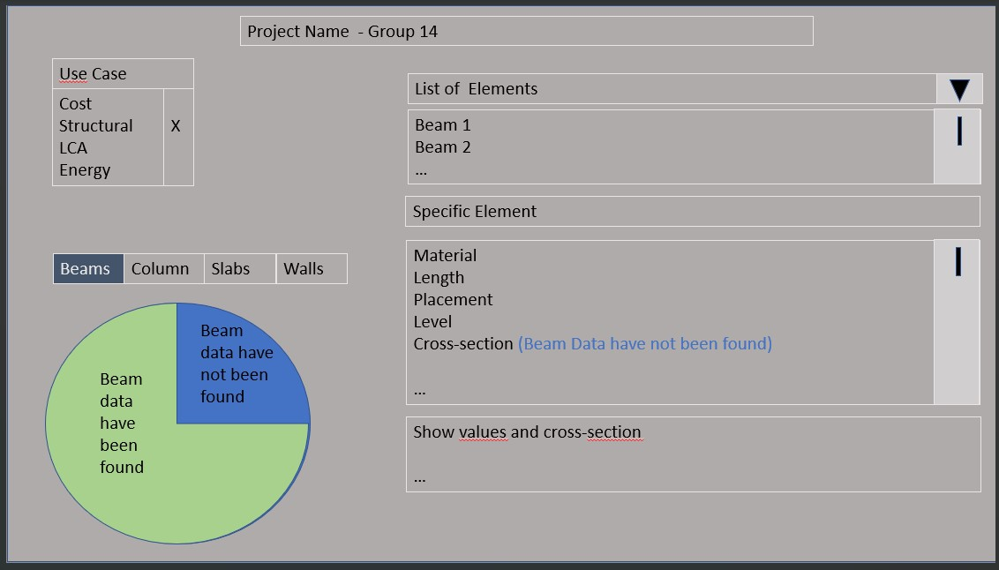

#### Tool Made by:
Oscar H. Hansen, Joakim B. Mørk, Valdemar Rasmussen and Jonas M. Hansen. 2022
 
## Beginning remarks:  
The goal was to make a universal script that would work for any IFC model that lives up to the standards of IFC modeling. 
For this project the scripting is based on a specific Ifc file(duplex.A) that does not live up to all of the standards for IFC modeling. This makes it hard to make a script that works on the available IFC models. So, the main.py script does not live up to the goal of a universal program for IFC, and therefore has some shortcomings.

Other shortcomings come from the way the data is accessed, because in this project, the path to a given data has been found using the duplex IFC model. So, for certain elements the program cannot find the information it needs, from another IFC model, for instance with the beams. The duplex model only contains HEB beams, so the program can only find information about HEB. If a model for instance contains another type of beam or the information is stored differently, this program will not be able to find all the available information. Therefore, a check system has been made to tell the user that if there is an error present and show what information it wasn’t able to find as well as inform the architects that some information is missing in the model. 

## Tool workflow:
The tool is thought out to extract information relevant for doing structural analysis of an ifc model. The extracted information is passed into excel where missing information is pointed out and relevant statistics are presented in an 'infosheet', giving the engineer an overview of how sufficiently the file is documented in terms of ifcopenshell, before structural analysis is done. 

## Markdown:

### Initial script preporation and packaging loading (Line: 7-37):
*Code line 7-9*
- For this script to work the listed packages is needed.  
 
*Line 16-23*
- Using the tkinter function to open a file via the users computers explorer.  
- The file is then saved as a path which is defined by the file that the user picks.  
 
*Line 25-27*
- Import xlsxwriter and numpy for later purposes 
 
*Line 32-37*
- Defining elements that is later to be extracted with the file.by_type function.  
- The elements are defined with the standard Ifc names.  

### Beams information extraction (Line: 38-152):
*Line 38-43*
- Creating empty vectors so that it is easy to fill them out later when the  
  information about the elements have been found.  
 
*Line 53-69*
- Defining all the different aspects of the beam that is to be extracted. Such as 
  name, material, dimensions etc.  
 
*Line 70-74*
- This is where the extracting begins, the first element is the beams.   
- A for loop is made for all beams.  
- The first information to be extracted is the beam numbering and beam name.  
- For the beam name is the script cannot find a beam.Name then it will be defined as ERROR 
 
*Line 77-126*
- Extracting material properties for the beams 
- The path to the information is specified for every property with the specific names found in the Ifc file.  
 
*Line 127-137*
- The property names will be defined like the beam name. If the script cannot find a value, then it will be labelled ERROR. 
 
*Line 139-149*
- The last thing is the coordinates for the beam.  
 
*Line 150-152*
- the information about the beams is transposed for the transfer to excel 

### Columns information extraction (Line: 155-259):
- The columns are made exactly the same as the beams.  
 
 

### Walls information extraction (Line: 260-355):
*Line 260 – 279*
- Empty vector are made for all of the information about the walls that we want to find. 

*Line  279-327*
- A for loop is run to find all of the IFC properties, and are put and saved into the empty vector.

*Line 327-333*
- A check of the data is run to see the data has been correct, and to locate where there has been an error, and there has been an error it is saved as an error to show the user later.

*Line 333- 340*
- The wall type is found in relAssociatesMaterial, the wall type is being checked and put in its vector.

*Line 340- 352*
- The coordinates for the wall are found, checked and put in to their matrix.

*Line 352-356*
- All of the vectors are combined into to a matrix, and saved as dataframe_walls. 

### Slabs information extraction:
*Line 363-375*
- Creating empty vectors just as done for beams, columns, and walls. 

*Line 379-385*
- Extracting the bearing slabs from floor finishes and exterior slabs 

*Line 391-392*
- Filling in slab_num vector with slab1, slab2 and so on. 

*Line 395-396*
- Putting “ERROR” in the slab_El_name vector if no name has been found else filling it in with the name of the given slab. 

*Line 401-452*
- The same is done as for beams, columns, and walls where properties are extracted from the structural walls, putting “ERROR” where the code fails to find the right property and putting the found properties in a vertical vector instead for later use. 

### Excel document creation:
*Line 460-466*
- Making a dialog box appear where the name of the future excel file with the properties can be written. 

*Line 475-481*
- Creating excel workbook with the user’s written name of the excel file and adding several excel sheets corresponding to the elements to which the properties belong.

*Line 486-488*
- Creating red and green colors for highlighting where there are errors and where there are no errors and defining font size and border on in the excel file.

*Line 495-596* 
- Creating tables in excel with the right properties corresponding to the structural elements.

*Line 602-612*
- Putting red color where there are errors on the missing property and green on where there are no errors.

*Line 619-669*
- Making a pie and column chart with an overview of the amount of errors found for the building and where the errors are placed and placing the charts in the ‘dashboard’, where the overall info is given.

*Line 671*
-The workbook of excel is closed 
 
 
## Future work: 
The future work for this tool could involve that it was fitted to a more general IFC file. This would mean that it could find all of the parameters in the building.  
Furthermore, this group had the idea to make a dashboard that could gather all the information to make it more manageable. The dashboard would ideally be on a website or a program that is more sensible than excel, to give others working on the program an overview of what information is missing for the building to make structural calculations. 
An example of this can be seen below.  
 
 
 
This dashboard could show all the information and unite the given project between all the engineers and architects.  
 
 
